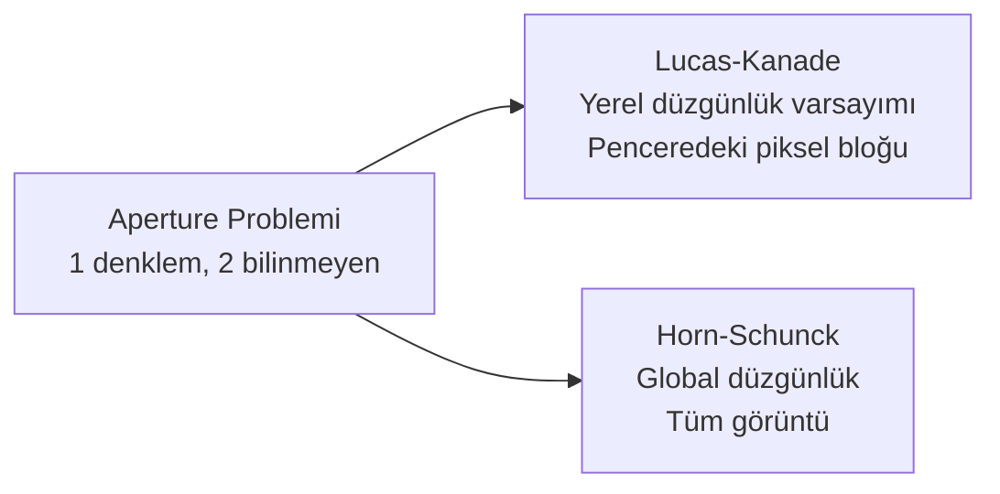
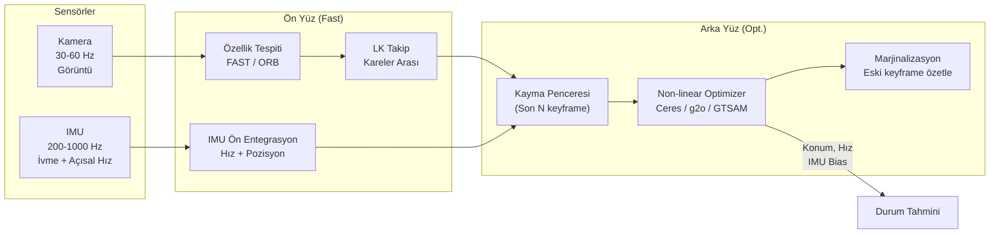
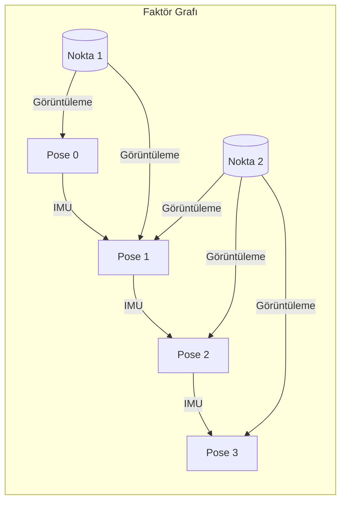
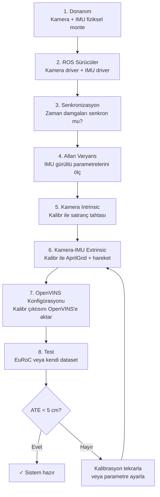

# VIO — Görsel-Atalet Odometri

!!! note "Bu Sayfa Ne Anlatıyor?"
    Optical Flow'dan başlayarak VIO'nun iç mimarisine, OpenVINS kurulumuna ve Kalibr ile kamera-IMU kalibrasyonuna kadar kapsamlı bir rehber. Her kavram "neden lazım?" sorusuna cevap vererek anlatılır.

---

## Optical Flow — Piksellerin Hareketi

### Temel Fikir

Bir videodan iki ardışık kare alın. Her pikselin bir sonraki karede nereye gittiğini bulursanız, kameranın veya sahnedeki nesnelerin nasıl hareket ettiğini anlayabilirsiniz. Bu hesaba **optical flow** (optik akış) denir.

```
Kare 1:          Kare 2:
┌─────────┐      ┌─────────┐
│  ⬤      │  →  │    ⬤    │
│         │      │         │
└─────────┘      └─────────┘
Piksel (100,150)  Piksel (115,148)

Hareket vektörü: (+15, -2) piksel
```

### Optik Akış Denklemi

İki hipotez:

1. **Parlaklık sabiti**: Kısa sürede bir pikselin parlaklığı değişmez: `I(x, y, t) = I(x+dx, y+dy, t+dt)`
2. **Küçük hareket**: Piksel bir sonraki karede çok uzağa gitmez

Taylor açılımı uygulanırsa:

```
∂I/∂x · u + ∂I/∂y · v + ∂I/∂t = 0

u = dx/dt  →  yatay hız
v = dy/dt  →  dikey hız
Ix, Iy    →  yatay/dikey gradyan (OpenCV'de Sobel ile hesaplanır)
It        →  zaman gradyanı (kare 2 - kare 1)
```

**Problem:** İki bilinmeyene (`u`, `v`) karşı tek denklem — **aperture problemi**. Bu yüzden ek kısıt gerekir.



---

### Lucas-Kanade — Seyrek Optik Akış

**Fikir:** Küçük bir penceredeki (ör. 15×15 piksel) tüm piksellerin aynı hareketi yaptığını varsay. Bu pencerede N piksel varsa N denklem elde edersin → iki bilinmeyen için aşırı belirlenmiş sistem → en küçük kareler (least squares) ile çöz.

```
N piksel × 1 denklem/piksel:
[Ix₁ Iy₁] [u]   [-It₁]
[Ix₂ Iy₂] [v] = [-It₂]
[  ...   ]       [ ... ]
[IxN IyN]        [-ItN]

A · d = b
d = (AᵀA)⁻¹Aᵀb   ← en küçük kareler çözümü
```

`AᵀA` matrisinin iyi şartlı olması için noktanın **köşe** olması gerekir — düz kenarlarda (`AᵀA` tekilleşir) akış hesaplanamaz. Bu yüzden önce iyi noktalar (köşeler) seçilir.

#### Piramit Lucas-Kanade — Büyük Hareketler İçin

Büyük hareketler "küçük hareket" hipotezini bozar. Çözüm: görüntüyü küçülterek büyük hareketi küçük gibi göster, sonra ince ayar yap.

```
Seviye 3 (1/8 boyut):  büyük hareketi düşük çözünürlükte kaba bul
Seviye 2 (1/4 boyut):  tahmini rafine et
Seviye 1 (1/2 boyut):  daha ince
Seviye 0 (orijinal):   piksel düzeyinde hassas
```

```python title="lk_optical_flow.py"
import cv2
import numpy as np

# Shi-Tomasi köşe tespiti (Lucas-Kanade için iyi noktalar)
feature_params = dict(
    maxCorners=300,
    qualityLevel=0.01,   # Bu puandan düşük köşeleri atla
    minDistance=10,       # Noktalar arası min piksel mesafesi
    blockSize=7
)

lk_params = dict(
    winSize=(21, 21),      # Arama penceresi boyutu
    maxLevel=3,            # Piramit seviyeleri (3 = 8× küçük en alt)
    criteria=(cv2.TERM_CRITERIA_EPS | cv2.TERM_CRITERIA_COUNT, 30, 0.01)
)

cap = cv2.VideoCapture(0)
ret, old_frame = cap.read()
old_gray = cv2.cvtColor(old_frame, cv2.COLOR_BGR2GRAY)
p0 = cv2.goodFeaturesToTrack(old_gray, mask=None, **feature_params)

tuval = np.zeros_like(old_frame)
renkler = np.random.randint(0, 255, (300, 3))
takip_id = list(range(len(p0)))

while True:
    ret, frame = cap.read()
    if not ret:
        break
    frame_gray = cv2.cvtColor(frame, cv2.COLOR_BGR2GRAY)

    # İleri takip
    p1, st, err = cv2.calcOpticalFlowPyrLK(old_gray, frame_gray, p0, None, **lk_params)

    # Geri takip (doğrulama için)
    p0_geri, st_geri, _ = cv2.calcOpticalFlowPyrLK(frame_gray, old_gray, p1, None, **lk_params)

    # İleri-geri hata: geri gelen nokta başlangıca yakınsa güvenilir
    hata = np.abs(p0 - p0_geri).reshape(-1, 2).max(axis=1)
    iyi = (st.flatten() == 1) & (hata < 1.0)

    for i, (yeni, eski) in enumerate(zip(p1[iyi], p0[iyi])):
        a, b = yeni.ravel().astype(int)
        c, d = eski.ravel().astype(int)
        idx  = np.where(iyi)[0][i]
        cv2.line(tuval, (a, b), (c, d), renkler[idx % 300].tolist(), 2)
        cv2.circle(frame, (a, b), 4, renkler[idx % 300].tolist(), -1)

    cv2.imshow("LK Optical Flow", cv2.add(frame, tuval))
    if cv2.waitKey(30) & 0xFF == ord('q'):
        break

    old_gray = frame_gray.copy()
    p0 = p1[iyi].reshape(-1, 1, 2)

    # Nokta sayısı azaldıysa yeni noktalar ekle
    if len(p0) < 50:
        yeni_noktalar = cv2.goodFeaturesToTrack(old_gray, mask=None, **feature_params)
        if yeni_noktalar is not None:
            p0 = np.vstack([p0, yeni_noktalar])
```

### Farneback — Yoğun Optik Akış

Tüm piksel için hareket vektörü hesaplar. LK'dan yavaş ama tam alan bilgisi verir.

```python title="farneback.py"
import cv2
import numpy as np

cap = cv2.VideoCapture(0)
ret, old = cap.read()
old_gray = cv2.cvtColor(old, cv2.COLOR_BGR2GRAY)

while True:
    ret, frame = cap.read()
    frame_gray = cv2.cvtColor(frame, cv2.COLOR_BGR2GRAY)

    flow = cv2.calcOpticalFlowFarneback(
        old_gray, frame_gray, None,
        pyr_scale=0.5,   # Her seviyede boyut oranı
        levels=3,        # Piramit seviyesi
        winsize=15,      # Yerelleştirme penceresi
        iterations=3,
        poly_n=5,        # Polinom boyutu
        poly_sigma=1.2,  # Gaussian sigma
        flags=0
    )
    # flow[y, x, 0] = dx, flow[y, x, 1] = dy

    # Görselleştirme: açı=renk, büyüklük=parlaklık
    mag, ang = cv2.cartToPolar(flow[..., 0], flow[..., 1])
    hsv = np.zeros_like(old)
    hsv[..., 1] = 255
    hsv[..., 0] = ang * 180 / np.pi / 2
    hsv[..., 2] = cv2.normalize(mag, None, 0, 255, cv2.NORM_MINMAX)
    bgr = cv2.cvtColor(hsv, cv2.COLOR_HSV2BGR)

    # Ortalama hareket: kamera mı hareket ediyor?
    ort_mag = np.mean(mag)
    if ort_mag > 3.0:
        cv2.putText(bgr, f"Hareket: {ort_mag:.1f} px/kare", (10, 30),
                    cv2.FONT_HERSHEY_SIMPLEX, 0.8, (0, 255, 0), 2)

    cv2.imshow("Farneback Flow", bgr)
    old_gray = frame_gray.copy()
    if cv2.waitKey(30) & 0xFF == ord('q'):
        break
```

### Sparse vs Dense Karşılaştırması

| | Lucas-Kanade (Seyrek) | Farneback (Yoğun) |
|--|:--------------------:|:-----------------:|
| Çıktı | Seçili noktalarda vektör | Her piksel vektör alanı |
| Hız | Hızlı (100+ FPS) | Yavaş (10-30 FPS) |
| Kullanım | VIO, nesne takibi | Segmentasyon, arka plan çıkarma |
| Büyük hareket | Piramit ile çözülür | Zayıf |
| Gürültü | İyi (pencere ortalama) | Orta |

---

## VIO — Visual Inertial Odometry

### VIO Neden Gerekli?

Sadece kamera (VO) ile robotun nerede olduğunu hesaplamak mümkün ama zor. IMU ekleyince sistem çok daha sağlam hale gelir.

| Sorun | Sadece VO | VO + IMU (VIO) |
|-------|:---------:|:--------------:|
| Mono kamerada ölçek belirsizliği | ✗ Bilinmez | ✓ IMU kurtarır |
| Hızlı hareket / bulanıklık | ✗ Takip bozulur | ✓ IMU köprü kurar |
| Karanlık / doku yok | ✗ Özellik bulunamaz | ✓ IMU kısa süre devralır |
| Uzun vadeli drift | ✗ Hata birikir | Kısmen: IMU bias tahmin edilir |
| Başlangıç oryantasyonu | Belirsiz | ✓ Yerçekimi vektörü |

**IMU'nun kendi sorunu:** Bias (sürüklenme) ve gürültü. Statik dururken bile ivmeölçer ve jiroskop sıfır göstermez — hafif sürüklenme (bias) var. Uzun süre entegre edilince büyük hata birikir. VIO bu bias'ı da tahmin eder.

### Sistem Bileşenleri



### IMU Ön Entegrasyon

İki kamera karesi arasında IMU 10-100 ölçüm yapabilir. Bu ölçümleri tek bir "delta konum" ve "delta oryantasyon" olarak özetlemek gerekir — buna **IMU preintegration** denir.

```
Kamera karesi k → Kamera karesi k+1 arasında:
IMU 20 ölçüm yaptı: [a₁, ω₁], [a₂, ω₂], ..., [a₂₀, ω₂₀]

Ön entegrasyon:
ΔR_{k,k+1}  = R₁ · R₂ · ... · R₂₀   ← toplam dönüş
Δv_{k,k+1}  = Σ Rᵢ · (aᵢ - bₐ) · dt  ← hız değişimi
Δp_{k,k+1}  = Σ [Δvᵢ · dt + ½Rᵢ · aᵢ · dt²]  ← konum değişimi

bₐ = ivmeölçer bias (sürekli tahmin edilir)
bω = jiroskop bias (sürekli tahmin edilir)
```

Ön entegrasyon bias tahminleri değiştiğinde Jacobian ile yeniden hesaplamadan düzeltilebilir — bu büyük hesaplama tasarrufu sağlar.

### EKF vs Faktör Grafı

**EKF (Extended Kalman Filter) yaklaşımı:**
- Anlık durum tahmini: konum, hız, oryantasyon, IMU bias
- Ölçüm geldiğinde tahmin güncellenir
- Hızlı ama yakınsama garanti değil, geçmiş göz ardı edilir
- Kullanım: MSCKF, ROVIO

**Faktör Grafı + Sliding Window yaklaşımı:**
- Son N keyframe ve aralarındaki kısıtları tutan bir grafik
- Her yeni ölçüm, bir kenar (faktör) olarak eklenir
- Grafik minimize edilir (non-linear least squares)
- Yavaş ama daha doğru, geçmiş bilgiyi kullanır
- Kullanım: VINS-Mono, ORB-SLAM3, OpenVINS



### MSCKF — Multi-State Constraint Kalman Filter

MSCKF (Mourikis & Roumeliotis, 2007), VIO'nun temeli olan algoritmadır. Harita noktalarını state'e eklemez — bunun yerine bir özellik noktasının birden fazla kamera pozisyonunda görülmesiyle oluşan geometrik kısıtı kullanır.

```
Geleneksel EKF-SLAM:
  State = [robot_pozisyonu, tüm harita noktaları]
  N harita noktası → N×3 boyutlu state → çok büyük matris

MSCKF:
  State = [son M kamera pozisyonu, IMU durumu]
  Harita noktaları state'de YOK
  Bir nokta M karede görülünce → M ölçüm → tek kısıt
  
  Avantaj: Sabit boyutlu state, gerçek zamanlı çalışır
```

### Kayma Penceresi Optimizasyonu (Sliding Window)

```
Zaman →
│ KF₀ │ KF₁ │ KF₂ │ KF₃ │ KF₄ │ KF₅ │
            ↑ Pencere başlangıcı

Yeni KF₆ gelince:
- Pencere içindeki tüm faktörler yeniden optimize edilir
- KF₀ pencerenin dışına çıkar → marjinalizasyon
```

**Marjinalizasyon:** KF₀'ı doğrudan silmek bilgi kaybına yol açar. Bunun yerine KF₀'ın kısıtları bir prior faktörüne özetlenerek pencereye eklenir.

### Stereo Kamera: VIO'da Avantajları

| Özellik | Mono | Mono+IMU | Stereo | Stereo+IMU |
|---------|:----:|:--------:|:------:|:----------:|
| Ölçek | ✗ | ✓ (başlatma sonrası) | ✓ | ✓ |
| Derinlik | ✗ | Kısmi | ✓ | ✓ |
| Başlatma kolaylığı | Düşük | Orta | **Kolay** | Kolay |
| Hesaplama | Az | Orta | Çok | **En çok** |
| Sağlamlık | Düşük | Orta | İyi | **En iyi** |

!!! tip "Pratik Öneri"
    - Küçük drone, ağırlık kritik → **Mono + IMU** (OpenVINS mono)
    - Kapalı alan, metrik konum → **Stereo + IMU** (OpenVINS stereo-inertial)
    - Derinlik sensörü olarak → **Stereo** veya RGB-D

---

## OpenVINS — Açık Kaynak VIO Sistemi

**OpenVINS**, Wisconsin Üniversitesi tarafından geliştirilen MSCKF bazlı VIO sistemidir. Akademik çevrede referans uygulama sayılır.

```
Özellikler:
✓ MSCKF + Sliding window hybrid
✓ Mono, Stereo, RGB-D kamera desteği
✓ Çoklu kamera kalibrasyonu (extrinsic online)
✓ ROS 1 ve ROS 2 desteği
✓ Kapsamlı parametre dokümantasyonu
✓ EuRoC, TUM-VI dataset'leriyle doğrulanmış
```

### Kurulum (ROS 2 Humble)

```bash
mkdir -p ~/ws_ov/src && cd ~/ws_ov/src

# OpenVINS kodu
git clone https://github.com/rpng/open_vins.git

# Bağımlılıklar
sudo apt install ros-humble-eigen3-cmake-module \
                 ros-humble-cv-bridge \
                 ros-humble-image-transport

# Derleme
cd ~/ws_ov
colcon build --symlink-install --cmake-args -DCMAKE_BUILD_TYPE=Release

source install/setup.bash
```

### Temel Konfigürasyon

OpenVINS bir YAML konfigürasyon dosyasıyla çalışır. En kritik parametreler:

```yaml title="config/my_camera_imu.yaml"
# ──────────────────────────────────────────
# Kamera - IMU zaman senkronizasyonu
# ──────────────────────────────────────────
calib_camimu_dt: 0.0        # Kamera-IMU gecikme farkı (saniye)
                              # Kalibr ile ölçülür

# ──────────────────────────────────────────
# IMU gürültü modeli (IMU datasheet'ten al)
# ──────────────────────────────────────────
imu_noises:
  gyro_n:  0.005     # Jiroskop gürültü yoğunluğu (rad/s/√Hz)
  accel_n: 0.1       # İvmeölçer gürültü yoğunluğu (m/s²/√Hz)
  gyro_b:  0.0002    # Jiroskop bias değişim hızı (rad/s²/√Hz)
  accel_b: 0.002     # İvmeölçer bias değişim hızı (m/s³/√Hz)

# ──────────────────────────────────────────
# Başlangıç ayarları
# ──────────────────────────────────────────
init_window_time: 1.0      # Başlangıç için bekleme süresi (s)
init_imu_thresh: 1.5       # Başlamak için minimum hareket eşiği (m/s²)
gravity_mag: 9.81          # Yerçekimi ivmesi (m/s²)

# ──────────────────────────────────────────
# Özellik takip ayarları
# ──────────────────────────────────────────
num_pts: 200               # Takip edilecek nokta sayısı
fast_threshold: 15         # FAST köşe tespiti eşiği
grid_x: 5                  # Görüntüyü 5×5 ızgaraya böl (uniform dağılım)
grid_y: 5
min_px_dist: 10            # Takip noktaları arası min piksel
knn_ratio: 0.70            # Lowe ratio test eşiği

# ──────────────────────────────────────────
# Durum tahmini
# ──────────────────────────────────────────
max_cameras: 1             # 1=Mono, 2=Stereo
use_stereo: false
max_clones: 11             # Sliding window boyutu (state'teki max kamera sayısı)
max_slam: 50               # SLAM noktası sayısı (MSCKF + SLAM hybrid)

# ──────────────────────────────────────────
# Kamera intrinsic parametreleri (Kalibr'den al)
# ──────────────────────────────────────────
camera_config:
  cam0:
    camera_model: "pinhole"
    distortion_model: "radtan"    # radyal-teğetsel
    intrinsics: [458.654, 457.296, 367.215, 248.375]  # fx fy cx cy
    distortion_coeffs: [-0.28340811, 0.07395907, 0.00019359, 1.76187114e-05]
    resolution: [752, 480]

# ──────────────────────────────────────────
# Kamera - IMU extrinsic (Kalibr'den al)
# ──────────────────────────────────────────
T_cam_imu:                 # Kameranın IMU çerçevesindeki dönüşümü
  - [0.0148655, -0.999880,  0.00414695, -0.0216401]
  - [0.999557,   0.0149672, 0.025715,   -0.064677 ]
  - [-0.025719,  0.003756,  0.999661,    0.00981073]
  - [0.0,        0.0,       0.0,         1.0       ]
```

### Başlatma ve Çalıştırma

```bash
# EuRoC dataset ile test
ros2 launch ov_msckf subscribe.launch.py \
    config:=euroc_mav \
    bag:=/path/to/MH_01_easy.bag

# Kendi sensörünüzle
ros2 launch ov_msckf subscribe.launch.py \
    config:=my_camera_imu \
    max_cameras:=1

# Parametrelerle doğrudan
ros2 run ov_msckf run_subscribe_msckf \
    --ros-args \
    -p config_path:=/home/user/ws_ov/src/open_vins/config/my_camera_imu.yaml \
    -p use_stereo:=false \
    -p num_pts:=150
```

### Yayınlanan Topic'ler

```bash
# Durum tahmini
ros2 topic echo /ov_msckf/odometry          # Pozisyon + Oryantasyon + Hız

# Görselleştirme
ros2 topic echo /ov_msckf/pathimu           # IMU odometry yolu
ros2 topic echo /ov_msckf/points_slam       # SLAM nokta bulutu
ros2 topic echo /ov_msckf/tracking_image    # Takip edilen noktalar (görüntü)

# Kovaryans: belirsizlik büyük → tahmin güvenilir değil
ros2 topic echo /ov_msckf/odometry | grep covariance
```

### Performans Değerlendirme

```bash
# EuRoC üzerinde karşılaştırma
# Başarı metriği: ATE (Absolute Trajectory Error) — gerçek yol ile tahmini yol farkı

ros2 launch ov_eval comparison.launch.py \
    path_gt:=/path/to/ground_truth.csv \
    path_est:=/path/to/estimated_traj.csv
```

---

## Kalibr — Kamera ve IMU Kalibrasyonu

**Kalibr**, ETH Zürich'in geliştirdiği kapsamlı kalibrasyon araç setidir.

```
Kalibr ile neler yapılır?
✓ Tek kamera intrinsic kalibrasyonu
✓ Stereo extrinsic kalibrasyonu (sol-sağ kamera arası)
✓ Kamera-IMU extrinsic kalibrasyonu (T_cam_imu)
✓ Kamera-IMU zaman gecikmesi (temporal offset)
✓ Çoklu kamera kalibrasyonu
```

### Hedef Tipler

Kalibr üç farklı kalibrasyon hedefi destekler:

| Hedef | Avantaj | Dezavantaj |
|-------|---------|------------|
| **Satranç tahtası** | Ucuz, kolay yazdır | Kenar noktaları az → az kısıt |
| **AprilGrid** (önerilen) | Her kare benzersiz tanımlı → eksik görüşte çalışır | Daha zor baskı |
| **CircleGrid** | Daha fazla merkez noktası | Perspektifle özellik kayması |

```python title="april_grid_olustur.py"
# AprilGrid PDF oluştur (Kalibr ile birlikte gelir)
# rosrun kalibr kalibr_create_target_pdf --type aprilgrid \
#   --nx 6 --ny 6 --size 0.088 --spacing 0.3 \
#   --output april_grid_6x6.pdf
```

```yaml title="april_target.yaml"
target_type: 'aprilgrid'
tagCols:     6        # Yatay etiket sayısı
tagRows:     6        # Dikey etiket sayısı
tagSize:     0.088    # Etiket boyutu (metre cinsinden)
tagSpacing:  0.3      # Etiketler arası boşluk oranı (tagSize'a göre)
```

### Kurulum (Docker — Önerilen)

```bash
# Kalibr'i Docker ile çalıştır (bağımlılık sorunları olmadan)
docker pull stereolabs/kalibr:latest

# Veya kaynak koddan derleme (ROS 1 Noetic)
sudo apt install python3-setuptools python3-rosinstall \
                 ipython3 libeigen3-dev libboost-all-dev \
                 libsuitesparse-dev

cd ~/catkin_ws/src
git clone https://github.com/ethz-asl/kalibr.git
cd ~/catkin_ws
catkin build -DCMAKE_BUILD_TYPE=Release -j$(nproc)
```

### 1. Tek Kamera Intrinsic Kalibrasyonu

```bash
# ROS bag hazırla: kamerayı yavaş hareket ettirerek kayıt al
# Yaklaşık 60-120 saniye, farklı açılar ve mesafeler

# Kalibrasyon
rosrun kalibr kalibr_calibrate_cameras \
    --bag ~/kalibrasyon.bag \
    --topics /camera/image_raw \
    --models pinhole-radtan \
    --target ~/april_target.yaml \
    --dont-show-report

# Çıktı dosyaları:
# kalibrasyon-camchain.yaml  ← intrinsic parametreler
# kalibrasyon-results.txt    ← hata istatistikleri
# kalibrasyon-report.pdf     ← görsel rapor
```

```yaml title="camchain.yaml (örnek çıktı)"
cam0:
  camera_model: pinhole
  intrinsics: [460.12, 459.45, 365.23, 244.82]   # fx, fy, cx, cy (piksel)
  distortion_model: radtan
  distortion_coeffs: [-0.284, 0.074, 0.0001, -0.00002]  # k1, k2, p1, p2
  resolution: [752, 480]
  timeshift_cam_imu: 0.0   # Kamera-IMU zaman farkı (henüz IMU yok)
  rostopic: /camera/image_raw
```

**Reprojection error < 0.5 piksel** → iyi kalibrasyon.

### 2. Stereo Kamera Kalibrasyonu

```bash
# İki kamera aynı anda kayıt
rosbag record -O stereo_kalib.bag \
    /cam0/image_raw /cam1/image_raw

# Kalibrasyon
rosrun kalibr kalibr_calibrate_cameras \
    --bag stereo_kalib.bag \
    --topics /cam0/image_raw /cam1/image_raw \
    --models pinhole-radtan pinhole-radtan \
    --target ~/april_target.yaml
```

```yaml title="stereo-camchain.yaml (örnek çıktı)"
cam0:
  camera_model: pinhole
  intrinsics: [458.654, 457.296, 367.215, 248.375]
  distortion_coeffs: [-0.28340811, 0.07395907, 0.00019359, 1.76187114e-05]
  resolution: [752, 480]
  T_cn_cnm1:    # cam0'ın kendi çerçevesi (referans)
    - [1,0,0,0]
    - [0,1,0,0]
    - [0,0,1,0]
    - [0,0,0,1]

cam1:
  camera_model: pinhole
  intrinsics: [457.587, 456.134, 379.999, 255.238]
  distortion_coeffs: [-0.28368365, 0.07451284, -0.00010473, -3.555e-05]
  resolution: [752, 480]
  T_cn_cnm1:    # cam1'in cam0'a göre dönüşümü (extrinsic)
    - [ 0.99997,   0.00699, -0.00337,  -0.11002]   # Taban çizgisi ~11 cm
    - [-0.00701,   0.99997, -0.00208,   0.00003]
    - [ 0.00336,   0.00210,  0.99999,   0.00013]
    - [ 0.0,       0.0,      0.0,       1.0    ]
```

### 3. Kamera-IMU Kalibrasyonu (En Önemli Adım)

Bu adım, kameranın IMU çerçevesine göre tam konumunu ve yönünü ölçer. Ayrıca kamera-IMU zaman gecikmesini de tahmin eder.

```bash
# IMU mesajını kayıt kapsamına ekle
rosbag record -O cam_imu_kalib.bag \
    /camera/image_raw \
    /imu/data

# Kayıt sırasında nasıl hareket etmeli?
# ✓ Tüm eksenler boyunca döndür (roll, pitch, yaw)
# ✓ Tüm eksenler boyunca ötelemeli hareket
# ✓ Hedefi her zaman görünür tut
# ✓ Yaklaşık 2-5 dakika
# ✗ Çok hızlı hareket etme (blur)
# ✗ Çok yavaş hareket etme (IMU gürültüsü dominant)
```

```bash
# Kalibrasyon (önceki camchain.yaml gerekli)
rosrun kalibr kalibr_calibrate_imu_camera \
    --bag ~/cam_imu_kalib.bag \
    --cam ~/camchain.yaml \
    --imu ~/imu_params.yaml \
    --target ~/april_target.yaml \
    --dont-show-report

# Çıktı:
# cam_imu_kalib-results-imucam.txt
# cam_imu_kalib-camchain.yaml  ← T_cam_imu dahil
```

```yaml title="imu_params.yaml"
# IMU gürültü modeli — datasheet veya Allan varyans'tan al
rostopic: /imu/data
update_rate: 200.0    # Hz

# Gürültü yoğunlukları (continuous time)
accelerometer_noise_density:   0.01    # m/s²/√Hz
accelerometer_random_walk:     0.001   # m/s³/√Hz
gyroscope_noise_density:       0.005   # rad/s/√Hz
gyroscope_random_walk:         0.0001  # rad/s²/√Hz
```

```yaml title="cam_imu_kalib-camchain.yaml (örnek çıktı)"
cam0:
  T_cam_imu:          # Kameranın IMU çerçevesindeki yeri
    - [ 0.01486,  -0.99988,   0.00415,  -0.02164]
    - [ 0.99956,   0.01497,   0.02572,  -0.06468]
    - [-0.02572,   0.00376,   0.99966,   0.00981]
    - [ 0.0,       0.0,       0.0,       1.0    ]
  timeshift_cam_imu: -0.00246    # saniye — kamera IMU'dan 2.46ms önce geliyor
  intrinsics: [458.654, 457.296, 367.215, 248.375]
  distortion_coeffs: [-0.28340811, 0.07395907, 0.00019359, 1.76187114e-05]
```

### Kalibr Çıktısını OpenVINS'e Aktarma

```python title="kalibr_to_openvins.py"
"""
Kalibr YAML → OpenVINS YAML dönüşüm yardımcısı
"""
import yaml
import numpy as np

def kalibr_to_openvins(kalibr_yaml: str, cikis_yaml: str):
    with open(kalibr_yaml) as f:
        data = yaml.safe_load(f)

    cam0 = data["cam0"]
    T_cam_imu = np.array(cam0["T_cam_imu"])
    T_imu_cam = np.linalg.inv(T_cam_imu)   # OpenVINS T_imu_cam bekler

    fx, fy, cx, cy = cam0["intrinsics"]
    k1, k2, p1, p2 = cam0["distortion_coeffs"]

    ov_config = {
        "camera_config": {
            "cam0": {
                "camera_model": "pinhole",
                "distortion_model": "radtan",
                "intrinsics": [fx, fy, cx, cy],
                "distortion_coeffs": [k1, k2, p1, p2],
                "resolution": cam0["resolution"],
            }
        },
        "T_cam_imu": T_cam_imu.tolist(),
        "calib_camimu_dt": cam0.get("timeshift_cam_imu", 0.0)
    }

    with open(cikis_yaml, "w") as f:
        yaml.dump(ov_config, f, default_flow_style=False)
    print(f"OpenVINS config yazıldı: {cikis_yaml}")

kalibr_to_openvins("cam_imu_kalib-camchain.yaml", "openvins_config.yaml")
```

---

## Allan Varyans — IMU Gürültü Parametrelerini Ölçmek

IMU datasheet'teki değerler her sensörde farklı. Kendi ölçümünüzü yapın.

```bash
# IMU'yu sabit tut, 1-2 saat veri kaydet
rosbag record -O imu_static.bag /imu/data -d 3600

# Allan varyans analizi
# pip install imu_utils  veya MATLAB/Python araçlarıyla
python3 imu_allan.py --bag imu_static.bag --imu_topic /imu/data

# Çıktı grafik:
# - Eğim -½ bölgesi → Angle/Velocity Random Walk (gürültü yoğunluğu)
# - Minimum nokta → Bias instability
# - Eğim +½ bölgesi → Rate/Acceleration Random Walk (bias sürüklenme)
```

---

## Tam Kurulum Akışı (Kamera + IMU)



### Sık Karşılaşılan Sorunlar

!!! warning "Kamera-IMU Senkronizasyon"
    Zaman damgaları hatalıysa VIO asla doğru çalışmaz. `timeshift_cam_imu` doğru tahmin edilmeli.
    
    Test: `ros2 topic echo /camera/image_raw --field header.stamp` ve `/imu/data --field header.stamp` karşılaştır — fark sabit ve küçük (< 10ms) olmalı.

!!! warning "Kamera Titremeye Karşı Hassas"
    Stereo kameranın iki kafası arasındaki extrinsic, titreme veya ısıl genleşmeyle değişir. Saha öncesi kalibrasyon yenile.

!!! tip "Hızlı Parametre Tahmini"
    IMU datasheet değerleri başlangıç için yeterli. Gerçek Allan varyans yoksa `gyro_n` ve `accel_n` için datasheet değerini 10× büyütün — aşırı güvensiz başlamak, çok güvenli başlamaktan iyidir.

!!! tip "OpenVINS Başlatma"
    Sistem başlarken **2-3 saniye sabit tut** → IMU bias başlangıç tahmini için. Ardından **her eksende yavaş hareket et** → ölçek ve extrinsic hızlı yakınsar.
